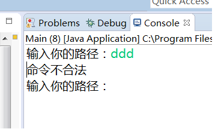

##使用java模拟实现cmd dir 目录显示功能
===============================

输入dir命令和主机硬盘路径 
 

对于一些输入语法错误有检错功能   
 

-----------------------------
*现在已经升级了程序，使得可以对路径的二级目录进行缩进显示*

**程序运行产生的结果，二级子目录前有适当缩进**

**实际文件夹内容，可以看到二者是一致的**

